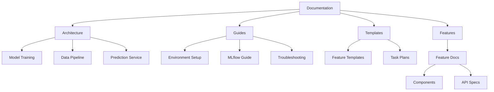

# Soccer Prediction Project Documentation

[← Back to Project Root](../README.md)

## Documentation Overview

This documentation is designed to provide comprehensive guidance for the Soccer Prediction Project, with special consideration for AI-assisted development and CPU-only environments.

### 🎯 Core Principles

- **CPU-Only Training**: All models and processing are optimized for CPU environments
- **High-Precision Focus**: Models are tuned for precision in draw predictions
- **Reproducible Results**: Consistent environment and experiment tracking
- **Documentation-Driven**: All changes must be documented before implementation

### 📚 Documentation Structure



### 📂 Directory Structure

- `architecture/` - System architecture and design decisions
- `guides/` - Setup and usage instructions
- `templates/` - Documentation templates
- `features/` - Feature-specific documentation
- `working-memory/` - AI assistant context and history

### 🔄 Version Control

All documentation changes are tracked in [DOCS-CHANGELOG.md](DOCS-CHANGELOG.md). Please update this file when making significant documentation changes.

### 🤖 AI Assistant Integration

This documentation is optimized for AI-assisted development. Key sections include:

- **Configuration Rules**: Defined in `.cursorrules`
- **Magic Values**: Documented in `architecture/constants.md`
- **Project State**: Tracked in `working-memory/`

### 🔍 Documentation Maintenance

#### Link Validation
Run the link checker periodically:
```bash
./scripts/check-doc-links.sh
```

#### Template Updates
When updating templates:
1. Update the template file
2. Run the migration script for existing docs
3. Update DOCS-CHANGELOG.md

### 📝 Feedback & Contributions

We welcome feedback on our documentation! Please:

1. [Create an issue](https://github.com/username/soccer-prediction/issues/new?labels=documentation) for content updates
2. [Submit a PR](https://github.com/username/soccer-prediction/pulls) for improvements
3. Tag issues with `documentation` for visibility

### ⚡ Quick Links

#### Core Documentation
- [Model Training Architecture](architecture/model_training.md)
- [Data Pipeline](architecture/data_pipeline.md)
- [MLflow Guide](guides/mlflow.md)

#### Supporting Guides
- [Environment Setup](guides/environment.md)
- [Code Quality](guides/code_quality.md)

#### Project Management
- [Changelog](CHANGELOG.md)

---

## Documentation Standards

### File Naming Conventions
- Use kebab-case for file names: `feature-name.md`
- Use PascalCase for class names: `FeatureName`
- Use snake_case for function names: `feature_function`

### Metadata Format
```yaml
---
title: Document Title
description: Brief description of the document
author: Original Author
created: YYYY-MM-DD
updated: YYYY-MM-DD
version: 1.0.0
tags: [documentation, feature, architecture]
---
```

### Cross-Reference Format
- Use relative paths from the document location
- Include document title in link text
- Add section references where applicable

Example:
```markdown
[Model Training Architecture](../architecture/model_training.md#overview)
```

### Code Examples
- Include language identifier in code blocks
- Add comments for complex logic
- Show both basic and advanced usage

Example:
```python
# Basic usage
model = XGBoostModel()

# Advanced configuration
model = XGBoostModel(
    tree_method='hist',  # CPU optimization
    early_stopping_rounds=500
)
```

---
[🔝 Back to Top](#soccer-prediction-project-documentation)

Generated: $(date +"%Y-%m-%d %H:%M:%S") 