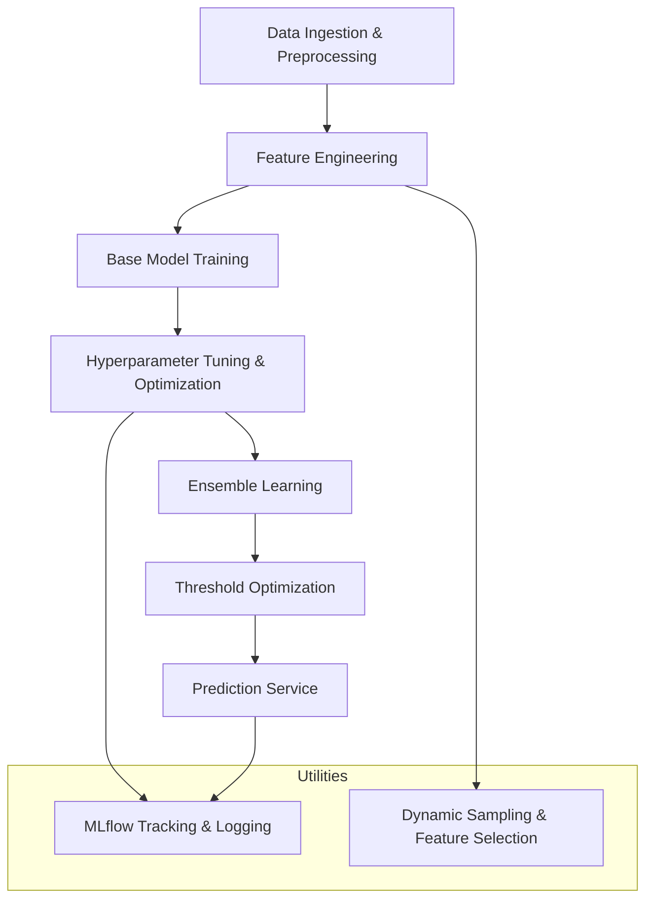

# Soccer Prediction Project Architecture

This document outlines the system architecture for the Soccer Prediction Project. The project aims to accurately predict soccer match draws and goal patterns using an ensemble of machine learning models, optimized for high precision. The system is designed for CPU-only environments and leverages MLflow for experiment tracking and hyperparameter optimization.

## Architecture Diagram

## System Components

- **Data Ingestion & Preprocessing:**  
  Data is loaded, cleaned, and validated using utilities in the `/utils` folder. This stage prepares the dataset for training by ensuring quality and proper formatting.

- **Feature Engineering:**  
  Custom feature engineering is implemented in `/utils/feature_selection.py` and `/utils/advanced_goal_features.py` to extract soccer-specific insights.

- **Base Model Training:**  
  Base models, including LightGBM, XGBoost, and others, are implemented in the `/models/StackedEnsemble` and `/models/ensemble` directories. These models are trained individually using optimized parameters for CPU-only environments.

- **Hyperparameter Tuning & Optimization:**  
  Hyperparameter tuning is performed using Optuna with persistent storage (e.g., SQLite via `optuna_lightgbm.db`). Dynamic sampling methods from `/utils/dynamic_sampler.py` help refine model parameters further.

- **Ensemble Learning:**  
  Predictions from the base models are combined to form a robust ensemble. The ensemble method harmonizes diverse model outputs to improve prediction precision.

- **Threshold Optimization:**  
  Post-training threshold tuning is applied to achieve the desired balance between precision and recall, ensuring reliable predictions for betting applications.

- **Prediction Service:**  
  The final ensemble model is deployed through the prediction service found in `/predictors/predict_ensemble.py`, which serves prediction requests in real-time.

- **Utilities:**  
  MLflow is used extensively for experiment tracking, model registration, and logging (see `/utils/logger.py` and `/utils/mlflow_utils.py`). Dynamic feature selection and error monitoring are integral utilities that support the entire pipeline.

## Data Flow & Process Overview

1. The system ingests raw soccer match data.
2. Features are engineered and selected based on domain knowledge.
3. Multiple base models are trained and tuned.
4. An ensemble method combines the predictions from these models.
5. Optimization of decision thresholds is carried out to meet target precision and recall.
6. Predictions are served via a dedicated prediction service.
7. Detailed logs and metrics are tracked using MLflow for reproducibility and analysis.

## Future Enhancements

- Integration of additional base models and deeper neural network architectures.
- Extended support for GPU-based training in future releases.
- Enhanced data validation and anomaly detection in the preprocessing stage.

By following this architecture, the Soccer Prediction Project ensures high-precision predictions with robust error handling and experiment tracking, making it a valuable tool for soccer analytics and betting applications.
