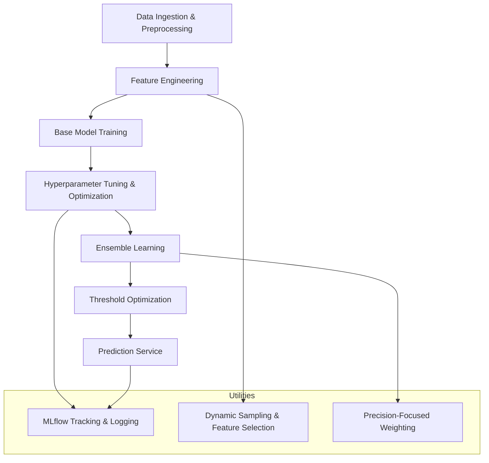

# Soccer Prediction Project Architecture

This document outlines the system architecture for the Soccer Prediction Project. The project aims to accurately predict soccer match draws and goal patterns using an ensemble of machine learning models, optimized for high precision. The system is designed for CPU-only environments and leverages MLflow for experiment tracking and hyperparameter optimization.

## Architecture Diagram

## System Components

- **Data Ingestion & Preprocessing:**  
  Data is loaded, cleaned, and validated using utilities in the `/utils` folder. This stage prepares the dataset for training by ensuring quality and proper formatting.

- **Feature Engineering:**  
  Custom feature engineering is implemented in  `/utils/advanced_goal_features.py` to extract soccer-specific insights.

- **Base Model Training:**  
  Base models, including **XGBoost**, **TabNet**, and **LightGBM**, are implemented in the `/models/StackedEnsemble` and `/models/ensemble` directories. The ensemble pipeline trains these as core models. **TabNet** is integrated via `pytorch_tabnet.tab_model.TabNetClassifier` with parameters tuned for high precision (learning_rate=0.02196, n_d=11, n_a=16, n_steps=9, gamma=1.8, lambda_sparse=2.48893e-05, momentum=0.95, mask_type='entmax').
  
- **Extra Model Options:**  
  Additional models such as **CatBoost**, **RandomForest**, **SVM**, and **MLP** are available as extra model options. Random Forest is currently being used as the default extra model option.

- **Hyperparameter Tuning & Optimization:**  
  Hyperparameter tuning is performed using Optuna with persistent storage (e.g., SQLite via `optuna_lightgbm.db`).

- **Ensemble Learning:**  
  The ensemble model integrates multiple base models using dynamic weighting based on model performance. The system implements precision-focused weighting through the `compute_precision_focused_weights_optimized` function, which prioritizes models with higher precision while maintaining minimum recall thresholds.

- **Threshold Optimization:**  
  Post-training threshold tuning is performed through `tune_threshold_for_precision_optimized`, which balances precision and recall with configurable targets (default target precision of 50% and minimum recall of 25%). The system supports both individual model thresholding and global ensemble thresholding.

- **Prediction Service:**  
  The final ensemble model is deployed via the prediction service found in `/predictors/predict_ensemble.py`, which serves prediction requests in real-time. The model is registered in MLflow with timestamp-based naming following the format `ensemble_YYYYMMDD_HHMM`.

- **Utilities:**  
  MLflow is used for experiment tracking, model registration, and logging, with additional utilities for dynamic feature selection, error monitoring, and precision filtering.

## Data Flow & Process Overview
1. The system ingests raw soccer match data.
2. Features are engineered and selected based on domain knowledge.
3. Multiple base models are trained and tuned.
4. An ensemble method combines the predictions from these models using precision-focused dynamic weighting.
5. Optimization of decision thresholds is carried out to meet target precision (≥50%) and recall (≥25%).
6. Predictions are served via a dedicated prediction service with MLflow model registry integration.
7. Detailed logs and metrics are tracked using MLflow for reproducibility and analysis.

## Future Enhancements
- Integration of additional base models and deeper neural network architectures.
- Extended support for GPU-based training in future releases.
- Enhanced data validation and anomaly detection in the preprocessing stage.

By following this architecture, the Soccer Prediction Project ensures high-precision predictions with robust error handling and experiment tracking, making it a valuable tool for soccer analytics and betting applications.
