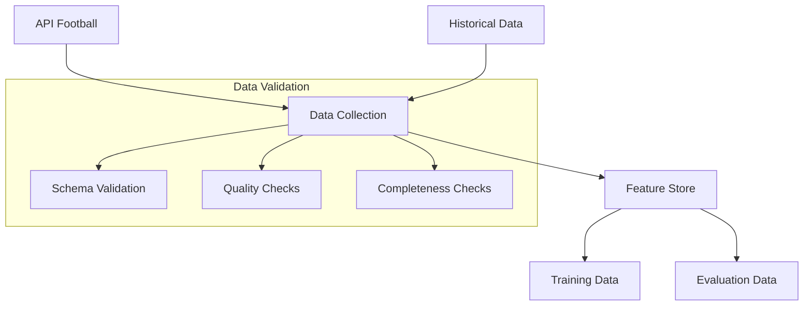

# Data Pipeline Architecture

[← Back to Documentation Home](../README.md)

## Table of Contents
- [Overview](#overview)
- [Architecture Components](#architecture-components)
  - [Data Sources](#1-data-sources)
  - [Feature Engineering](#2-feature-engineering)
  - [Data Validation](#3-data-validation)
- [Pipeline Workflow](#pipeline-workflow)
- [Data Quality](#data-quality)
- [Best Practices](#best-practices)
- [Troubleshooting](#troubleshooting)
- [Additional Resources](#additional-resources)

## Overview
This document outlines the data pipeline architecture for the Soccer Prediction Project, focusing on data collection, processing, and feature engineering for draw predictions.

### Technical Decisions
- **API Integration**: Real-time data collection from football APIs
- **Feature Engineering**: Automated and manual feature creation
- **Data Validation**: Strict quality checks and validation rules
- **Versioning**: MLflow-integrated data versioning

### Target Audience
- **Data Engineers**: Focus on pipeline implementation and optimization
- **ML Engineers**: Review feature engineering and data quality
- **Contributors**: Understand data flow and validation requirements

## Architecture Components

### 1. Data Sources



#### API Integration
```python
def get_real_api_scores_from_excel(fixture_ids: List[str]) -> Dict[str, Dict]:
    """Fetch real match scores from API."""
    try:
        client = MongoClient()
        db = client.soccer_db
        collection = db.match_results
        
        results = {}
        for fixture_id in fixture_ids:
            match = collection.find_one({"fixture_id": fixture_id})
            if match:
                results[fixture_id] = {
                    "match_outcome": match["is_draw"],
                    "home_score": match["home_score"],
                    "away_score": match["away_score"]
                }
        return results
    except Exception as e:
        logger.error(f"Error fetching scores: {e}")
        return {}
```

### 2. Feature Engineering

#### Feature Creation
```python
def create_evaluation_sets():
    """Create feature sets for model evaluation."""
    selected_columns = get_selected_columns()
    
    # Create advanced features
    feature_engineer = AdvancedGoalFeatureEngineer()
    features = feature_engineer.create_features(df)
    
    return features[selected_columns]
```

#### Feature Selection
```python
def get_selected_api_columns_draws():
    """Get optimized feature set for draw prediction."""
    selected_columns = [
        'referee_draw_rate',                # 0.0922
        'venue_draw_rate',                  # 0.0676
        'Away_goal_difference_cum',         # 0.0305
        'xg_momentum_similarity',           # 0.0211
        # ... additional features ...
    ]
    return selected_columns
```

### 3. Data Validation

#### Schema Validation
```python
def validate_training_data(
    path: str,
    min_samples: int = 1000,
    numeric_check: bool = True
) -> bool:
    """Validate training data quality and schema."""
    try:
        df = pd.read_csv(path)
        
        # Check minimum samples
        if len(df) < min_samples:
            raise ValueError(f"Insufficient samples: {len(df)} < {min_samples}")
            
        # Validate numeric columns
        if numeric_check:
            non_numeric = df.select_dtypes(exclude=['number']).columns
            if len(non_numeric) > 0:
                raise TypeError(f"Non-numeric columns found: {non_numeric}")
                
        return True
    except Exception as e:
        logger.error(f"Validation failed: {e}")
        return False
```

## Pipeline Workflow

### 1. Data Collection
1. Fetch API data
2. Load historical data
3. Merge and deduplicate

### 2. Feature Engineering
1. Create base features
2. Generate advanced features
3. Select optimal feature set

### 3. Data Splitting
1. Training set creation
2. Validation set preparation
3. Test set isolation

## Data Quality

### 1. Quality Metrics
| Metric | Threshold | Description |
|--------|-----------|-------------|
| Completeness | 99% | Required fields present |
| Accuracy | 95% | Data matches source |
| Timeliness | 24h | Max age of match data |

### 2. Validation Rules
- Minimum 1000 samples per training set
- No missing values in key features
- Numeric type enforcement
- Range validation for ratios (0-1)

## Best Practices

### 1. Data Collection
- Use API rate limiting
- Implement retry logic
- Cache frequent queries
- Log all API responses

### 2. Feature Engineering
- Document feature importance
- Version feature sets
- Test feature stability
- Monitor feature drift

### 3. Quality Control
- Run validation before training
- Log data quality metrics
- Alert on validation failures
- Track data lineage

## Troubleshooting

### Common Issues

1. **API Rate Limits**
```python
# Solution: Implement rate limiting
from ratelimit import limits, sleep_and_retry

@sleep_and_retry
@limits(calls=60, period=60)
def fetch_api_data(endpoint: str) -> Dict:
    """Rate-limited API call."""
    response = requests.get(endpoint)
    return response.json()
```

2. **Missing Data**
```python
# Solution: Fallback values
def safe_get_feature(row: pd.Series, feature: str, default: float = 0.0) -> float:
    """Safely get feature value with fallback."""
    try:
        return float(row[feature])
    except (KeyError, ValueError, TypeError):
        return default
```

3. **Data Type Mismatches**
```python
# Solution: Type enforcement
def enforce_types(df: pd.DataFrame, schema: Dict[str, str]) -> pd.DataFrame:
    """Enforce data types according to schema."""
    for col, dtype in schema.items():
        df[col] = df[col].astype(dtype)
    return df
```

## Additional Resources

- [MLflow Guide](../guides/mlflow.md)
- [Environment Setup](../guides/environment.md)

## Related Documentation

### Core Documentation
- [Model Training Architecture](model_training.md) - Training pipeline and model development
- [Prediction Service](prediction.md) - Model serving and predictions
- [MLflow Guide](../guides/mlflow.md) - Experiment tracking and model management

### Supporting Guides
- [Environment Setup](../guides/environment.md) - Development environment configuration
- [MLflow Guide](../guides/mlflow.md) - Model management and tracking

### Project Management
- [Changelog](../CHANGELOG.md) - Version history and updates

---
[🔝 Back to Top](#data-pipeline-architecture) 