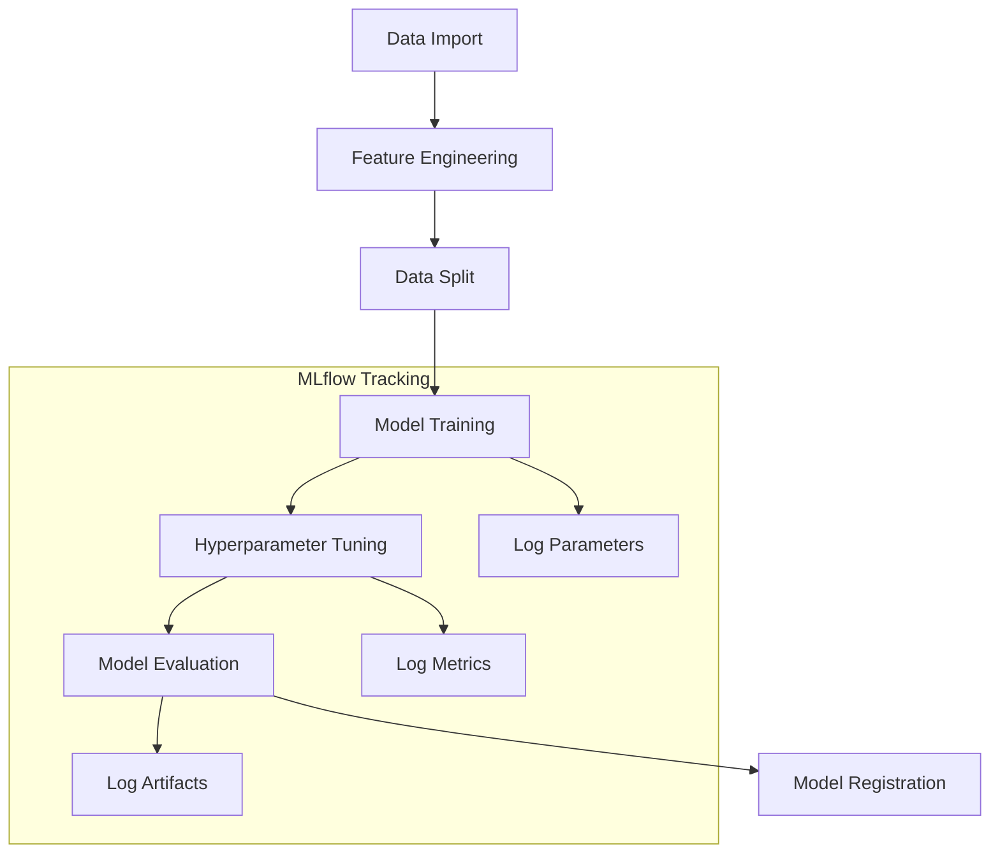

# Model Training Architecture

[← Back to Documentation Home](../README.md)

## Updates for Precision Improvement (v2.1)

### Precision-Recall Optimization
The model training pipeline now includes enhanced precision optimization while maintaining a minimum recall threshold:

```python
# Example of new objective function configuration
def objective(trial):
    """Optimize precision while maintaining 40% recall threshold."""
    # Model configuration
    params = {
        'tree_method': 'hist',  # CPU optimization
        'device': 'cpu',
        'scale_pos_weight': trial.suggest_float('scale_pos_weight', 0.1, 30.0)
        # ... other parameters
    }
    
    # Evaluation with recall constraint
    if recall >= 0.40:
        return precision  # Optimize precision when recall threshold is met
    else:
        raise optuna.exceptions.TrialPruned()
```

### Key Features
- **Recall Threshold**: Maintains minimum 40% recall
- **Precision Focus**: Optimizes precision after meeting recall requirement
- **Trial Pruning**: Automatically prunes trials not meeting recall threshold
- **Enhanced Metrics Tracking**: Detailed MLflow logging of precision-recall trade-offs

### MLflow Integration
```python
# Example of enhanced metrics logging
with mlflow.start_run(run_name="precision_optimization"):
    mlflow.log_params({
        "target_recall": 0.40,
        "optimization_metric": "precision",
        "recall_constraint": ">=0.40"
    })
```

### Visualization & Monitoring
- Parameter importance plots
- Optimization history tracking
- Parallel coordinate visualization
- Trial pruning statistics

## Table of Contents
- [Overview](#overview)
- [Architecture Components](#architecture-components)
  - [Model Types](#1-model-types)
  - [Training Pipeline](#2-training-pipeline)
- [Training Workflow](#training-workflow)
  - [Data Preparation](#1-data-preparation)
  - [Model Training](#2-model-training)
  - [Hyperparameter Optimization](#3-hyperparameter-optimization)
- [Model Evaluation](#model-evaluation)
- [Model Registration](#model-registration)
- [Best Practices](#best-practices)
- [Troubleshooting](#troubleshooting)
- [Additional Resources](#additional-resources)

## Overview
This document outlines the model training architecture and workflow for the Soccer Prediction Project. Our approach uses a combination of models optimized for high-precision draw predictions, with specific adaptations for CPU-only environments.

### Technical Decisions
- **XGBoost with CPU Optimization**: Chosen for efficiency on CPU-only environments using the 'hist' tree method
- **Two-Stage Ensemble**: Improves precision by using sequential model filtering
- **Voting Ensemble**: Reduces prediction variance through model consensus
- **MLflow Integration**: Ensures reproducibility and experiment tracking

### Target Audience
- **New Contributors**: Start with the [Environment Setup](../guides/environment.md) and [MLflow Guide](../guides/mlflow.md)
- **ML Engineers**: Focus on hyperparameter optimization and model architecture
- **DevOps**: Review model registration and MLflow integration

## Architecture Components

### 1. Model Types

#### XGBoost API Model
```python
class XGBoostModel:
    """Primary model for draw predictions with CPU optimization."""
    def __init__(self):
        self.global_params = {
            'objective': 'binary:logistic',
            'tree_method': 'hist',  # CPU-optimized
            'early_stopping_rounds': 500,
            'eval_metric': ['auc', 'error']
        }
        
    def train(self, X: pd.DataFrame, y: pd.Series):
        """Train model with early stopping and validation."""
        X_train, X_val, y_train, y_val = train_test_split(
            X, y, test_size=0.2, random_state=42
        )
        
        train_data = xgb.DMatrix(X_train, label=y_train)
        val_data = xgb.DMatrix(X_val, label=y_val)
        
        self.model = xgb.train(
            self.global_params,
            train_data,
            evals=[(val_data, 'validation')],
            verbose_eval=100
        )
```

#### PyCaret Model
```python
def train_with_pycaret(feature_matrix: pd.DataFrame):
    """Train model using PyCaret with automated selection."""
    setup = clf.setup(
        data=feature_matrix,
        target="is_draw",
        fix_imbalance=True,
        feature_selection=True,
        silent=True,
        verbose=False
    )
    
    best_model = clf.compare_models(
        n_select=3,
        sort='Precision'
    )
    
    return best_model
```

#### Ensemble Model
- Combines multiple model predictions
- Voting-based consensus
- Threshold optimization

### 2. Training Pipeline



## Training Workflow

### 1. Data Preparation
```python
def prepare_training_data():
    """Prepare and validate training data."""
    features_train, target_train = import_training_data_draws_api()
    
    # Validate data quality
    if not validate_training_data(features_train):
        raise ValueError("Training data validation failed")
    
    return features_train, target_train
```

### 2. Model Training
```python
def train_model(X: pd.DataFrame, y: pd.Series):
    """Train model with MLflow tracking."""
    with mlflow.start_run():
        model = XGBoostModel()
        
        # Log training parameters
        mlflow.log_params(model.global_params)
        
        # Train model
        model.train(X, y)
        
        # Log metrics
        metrics = evaluate_model(model, X, y)
        mlflow.log_metrics(metrics)
        
        return model
```

### 3. Hyperparameter Optimization
```python
def optimize_hyperparameters():
    """Optimize hyperparameters using Optuna."""
    study = optuna.create_study(
        direction="maximize",
        sampler=TPESampler(seed=42)
    )
    
    study.optimize(
        objective,
        n_trials=100,
        timeout=3600  # 1 hour
    )
    
    return study.best_params
```

## Model Evaluation

### Metrics Tracking
```python
def evaluate_model(model, X_test: pd.DataFrame, y_test: pd.Series):
    """Evaluate model performance."""
    predictions = model.predict(X_test)
    
    metrics = {
        'precision': precision_score(y_test, predictions),
        'recall': recall_score(y_test, predictions),
        'f1': f1_score(y_test, predictions),
        'auc': roc_auc_score(y_test, predictions)
    }
    
    # Log evaluation plots
    plot_confusion_matrix(y_test, predictions)
    plot_roc_curve(y_test, predictions)
    
    return metrics
```

## Model Registration

### 1. Artifact Management

```python
# Save model artifacts
mlflow.xgboost.log_model(
    model,
    "model_global",
    registered_model_name="xgboost_model"
)

# Log feature importance
mlflow.log_dict(
    feature_importance,
    "feature_importance.json"
)
```

### 2. Version Control

- Models are versioned using MLflow
- Version format: `{model_type}_YYYYMMDD_HHMM`
- Required artifacts:
  - Feature importance plots
  - Training analysis report
  - Model signature

## Best Practices

### 1. Training Standards
- Use consistent random seeds
- Implement early stopping
- Monitor resource usage
- Log all parameters

### 2. Model Selection
- Prioritize precision over recall
- Use cross-validation
- Compare multiple architectures
- Track experiment history

### 3. Quality Control
- Validate input data
- Test model stability
- Monitor convergence
- Version control models

## Troubleshooting

### Common Issues

1. **Memory Management**
```python
# Solution: Batch processing
def train_in_batches(X, y, batch_size=1000):
    """Train model in batches to manage memory."""
    for i in range(0, len(X), batch_size):
        batch_X = X[i:i+batch_size]
        batch_y = y[i:i+batch_size]
        yield batch_X, batch_y
```

2. **Convergence Issues**
```python
# Solution: Learning rate adjustment
def adjust_learning_rate(model, factor=0.1):
    """Adjust learning rate if not converging."""
    current_lr = model.get_params()['learning_rate']
    new_lr = current_lr * factor
    model.set_params(learning_rate=new_lr)
    return model
```

3. **Model Stability**
```python
# Solution: Cross-validation check
def check_model_stability(model, X, y, cv=5):
    """Check model stability across folds."""
    scores = cross_val_score(model, X, y, cv=cv)
    return scores.std() < 0.1  # Threshold for stability
```

## Additional Resources

- [XGBoost Documentation](https://xgboost.readthedocs.io/)
- [MLflow Model Registry](https://www.mlflow.org/docs/latest/model-registry.html)
- [Optuna Optimization](https://optuna.readthedocs.io/)

## Related Documentation

### Core Documentation
- [Prediction Service](prediction.md) - Model serving and predictions
- [Data Pipeline](data_pipeline.md) - Data processing and feature engineering
- [MLflow Guide](../guides/mlflow.md) - Model management and tracking

### Supporting Guides
- [Environment Setup](../guides/environment.md) - Development environment configuration
- [MLflow Guide](../guides/mlflow.md) - Model management and tracking

### Project Management
- [Changelog](../CHANGELOG.md) - Version history and updates

## Feature Selection

### Precision-Focused Selection
The feature selection process now uses a two-stage approach:

1. Standard Selection:
```python
standard_selector = EnhancedFeatureSelector(
    n_bootstrap=10,
    correlation_threshold=0.85,
    target_features=(60, 100)
)
```

2. Precision Impact Analysis:
```python
precision_selector = PrecisionFocusedFeatureSelector(
    min_recall=0.20,
    target_precision=0.50
)
```

### Feature Impact Scoring
Features are now scored using a composite metric:
- 70% precision impact
- 30% base importance

```python
combined_scores = 0.7 * precision_impact + 0.3 * importance_base
```

### Evaluation Process
Each feature set is evaluated for:
- Precision at 20% recall
- Overall model performance
- Feature stability
- Correlation analysis

---
[🔝 Back to Top](#model-training-architecture) 