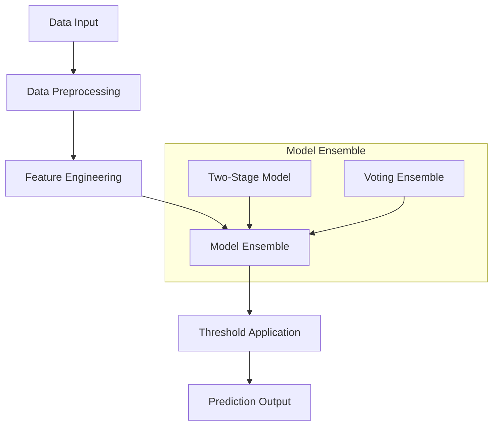

# Prediction Service Architecture

[← Back to Documentation Home](../README.md)

## Table of Contents
- [Overview](#overview)
- [Architecture Components](#architecture-components)
  - [Prediction Pipeline](#1-prediction-pipeline)
  - [Model Components](#2-model-components)
- [Prediction Workflow](#prediction-workflow)
  - [Data Preprocessing](#1-data-preprocessing)
  - [Feature Selection](#2-feature-selection)
  - [Model Prediction](#3-model-prediction)
- [Model Serving](#model-serving)
- [Performance Monitoring](#performance-monitoring)
- [Best Practices](#best-practices)
- [Troubleshooting](#troubleshooting)
- [Additional Resources](#additional-resources)

## Overview
This document outlines the prediction service architecture for the Soccer Prediction Project, focusing on model serving and real-time predictions. Our service is designed for high-precision draw predictions with robust error handling and performance monitoring.

### Technical Decisions
- **Two-Stage Filtering**: Optimized thresholds for precision-focused predictions
- **Voting Ensemble**: Multiple models for prediction stability
- **Batch Processing**: Efficient handling of multiple predictions
- **Performance Monitoring**: Real-time metric tracking

### Target Audience
- **New Contributors**: Start with [Model Training Architecture](model_training.md)
- **ML Engineers**: Focus on prediction optimization and monitoring
- **DevOps**: Review model serving and performance tracking

## Architecture Components

### 1. Prediction Pipeline



### 2. Model Components

#### Two-Stage Ensemble
```python
class TwoStageEnsemble:
    def __init__(self):
        self.threshold1 = 0.16836715298311486  # Stage 1 threshold
        self.threshold2 = 0.540659812513794    # Stage 2 threshold
        
    def predict(self, X: pd.DataFrame) -> np.ndarray:
        """Make final predictions requiring both stages to agree."""
        probs = self.predict_proba(X)[:, 1]
        return (probs >= self.threshold2).astype(int)
```

#### Voting Ensemble
```python
class VotingEnsemble:
    def __init__(self, n_models: int = 5):
        self.n_models = n_models
        self.thresholds = [
            0.4740239979396334,
            0.48142335166103045,
            0.4678564813108483,
            0.5210149679632807,
            0.5631989929103359
        ]
```

## Prediction Workflow

### 1. Data Preprocessing

```python
def _preprocess_data(df: pd.DataFrame) -> pd.DataFrame:
    """Preprocess data to handle number formats and missing values."""
    df = df.copy()
    
    for col in df.columns:
        df[col] = (
            df[col]
            .apply(lambda x: str(x) if pd.notnull(x) else '0')
            .str.replace('[^0-9.eE-]', '', regex=True)
            .pipe(pd.to_numeric, errors='coerce')
            .fillna(0)
        )
    
    return df
```

### 2. Feature Selection

```python
def prepare_features(df: pd.DataFrame) -> pd.DataFrame:
    """Prepare features for prediction."""
    selected_columns = get_selected_api_columns_draws()
    return df[selected_columns]
```

### 3. Model Prediction

```python
class DrawPredictor:
    def predict(self, df: pd.DataFrame) -> Dict[str, Any]:
        """Make predictions and return results with probabilities."""
        predict_df = df[self.required_columns]
        probas = self.model.predict_proba(predict_df)
        predictions = self.model.predict(predict_df)
        
        return {
            'predictions': predictions.tolist(),
            'draw_probabilities': probas[:, 1].tolist(),
            'threshold_used': self.threshold,
            'num_predictions': len(predictions),
            'positive_predictions': int(predictions.sum()),
            'prediction_rate': float(predictions.mean())
        }
```

## Model Serving

### 1. Model Loading

```python
def load_model(run_id: str) -> Any:
    """Load model from MLflow registry."""
    model_uri = f"runs:/{run_id}/model_global"
    return mlflow.xgboost.load_model(model_uri)
```

### 2. Batch Prediction

```python
def make_batch_predictions(
    prediction_data: pd.DataFrame,
    model_uri: str,
    selected_columns: List[str]
) -> Tuple[pd.DataFrame, float, float]:
    """Make batch predictions with performance metrics."""
    predictor = DrawPredictor(model_uri)
    results = predictor.predict(prediction_data[selected_columns])
    
    # Add predictions to dataframe
    prediction_df = prediction_data.copy()
    prediction_df['draw_predicted'] = results['predictions']
    prediction_df['draw_probability'] = [
        round(prob, 2) for prob in results['draw_probabilities']
    ]
    
    return prediction_df, results['precision'], results['recall']
```

### 3. Real-time Prediction

```python
def predict_single_match(row: pd.Series) -> Dict[str, Any]:
    """Make prediction for a single match."""
    df = pd.DataFrame([row])
    probas = self.model.predict_proba(df)
    prediction = self.model.predict(df)
    
    return {
        'is_draw': bool(prediction[0]),
        'draw_probability': float(probas[0, 1]),
        'confidence': float(max(probas[0]))
    }
```

## Performance Monitoring

### 1. Metrics Tracking

```python
def track_prediction_metrics(
    predictions: np.ndarray,
    actual_results: np.ndarray
) -> Dict[str, float]:
    """Track prediction performance metrics."""
    return {
        'precision': precision_score(actual_results, predictions),
        'recall': recall_score(actual_results, predictions),
        'f1': f1_score(actual_results, predictions),
        'predicted_rate': predictions.mean(),
        'actual_rate': actual_results.mean()
    }
```

### 2. Model Validation

```python
def validate_predictions(
    prediction_df: pd.DataFrame,
    fixture_ids: List[int]
) -> Dict[str, Any]:
    """Validate predictions against real results."""
    real_scores = get_real_api_scores_from_excel(fixture_ids)
    metrics = calculate_metrics(prediction_df, real_scores)
    
    return {
        'metrics': metrics,
        'total_matches': len(prediction_df),
        'predicted_draws': prediction_df['draw_predicted'].sum(),
        'actual_draws': sum(real_scores.values())
    }
```

## Best Practices

### 1. Data Validation
- Validate input data types
- Check for missing values
- Ensure feature consistency

### 2. Error Handling
- Implement graceful fallbacks
- Log prediction errors
- Monitor prediction latency

### 3. Performance Optimization
- Use batch predictions when possible
- Implement caching for frequent predictions
- Monitor resource usage

## Troubleshooting

### Common Issues

1. **Missing Features**
```python
# Solution: Feature validation
def validate_features(df: pd.DataFrame) -> None:
    missing_cols = set(required_columns) - set(df.columns)
    if missing_cols:
        raise ValueError(f"Missing columns: {missing_cols}")
```

2. **Type Conversion**
```python
# Solution: Safe type conversion
def safe_convert(value):
    try:
        return pd.to_numeric(value, errors='coerce')
    except:
        return 0.0
```

3. **Memory Management**
```python
# Solution: Batch processing
def process_in_batches(df: pd.DataFrame, batch_size: int = 1000):
    for i in range(0, len(df), batch_size):
        yield df.iloc[i:i+batch_size]
```

## Additional Resources

- [MLflow Model Serving](https://www.mlflow.org/docs/latest/models.html)
- [XGBoost Prediction Guide](https://xgboost.readthedocs.io/en/latest/prediction.html)
- [Pandas Data Processing](https://pandas.pydata.org/docs/user_guide/index.html)

## Related Documentation

### Core Documentation
- [Model Training Architecture](model_training.md) - Training pipeline and model development
- [Data Pipeline Architecture](data_pipeline.md) - Data processing and feature engineering
- [MLflow Guide](../guides/mlflow.md) - Experiment tracking and model management

### Supporting Guides
- [Environment Setup](../guides/environment.md) - Development environment configuration
- [Troubleshooting Guide](../guides/troubleshooting.md) - Common issues and solutions

### Project Management
- [Project Plan](../plan.md) - Current project status and roadmap
- [Development History](../composer-history) - Task history and decisions
- [Changelog](../CHANGELOG.md) - Version history and updates

---
[🔝 Back to Top](#prediction-service-architecture) 