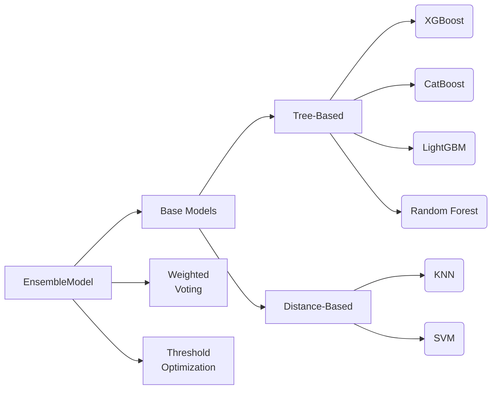

# Ensemble Model Documentation (v2.1.3)

**File:** `models/ensemble_model.py`  
**Last Updated:** 2024-03-15  
**Composer Plan:** [Plan #0047](../docs/plan.md)  



## 1. Key Components

### 1.1 Base Models
```python
self.base_models = [
    ("xgb", xgb_model),
    ("cat", cat_model), 
    ("lgbm", lgbm_model),
    ("rf", rf_model),
    ("knn", knn_model),
    ("svm", svm_model)
]
```

| Model | Type | Training Samples | Features | Calibration |
|-------|------|------------------|----------|-------------|
| XGBoost | Gradient Boosted Trees | Full Dataset | 50+ | Sigmoid |
| CatBoost | Oblivious Trees | Full Dataset | 50+ | Isotonic |
| LightGBM | Gradient Boosting | Full Dataset | 50+ | Sigmoid |
| Random Forest | Bagged Trees | Full Dataset | 30 | Isotonic |
| KNN | Instance-Based | ≤50k | 10 | None |
| SVM | Maximum Margin | ≤10k | 15 | Sigmoid |

### 1.2 Feature Management
```python
self.feature_sets = {
    'xgb': xgb_features,
    'cat': cat_features,
    'lgbm': lgbm_features,
    'rf': rf_features,
    'knn': knn_features,
    'svm': svm_features
}
```

**Validation Process:**
```python
def _validate_features(self, X):
    missing = set(all_required) - set(X.columns)
    if missing: 
        raise ValueError(f"Missing features: {missing}")
```

## 2. Training Process

### 2.1 Model Initialization
```python
# Attempt to load pretrained models
model = load_pretrained_model(run_id, model_type)

# Fallback training
if model is None:
    model = {
        "random_forest": RandomForestClassifier(n_jobs=-1),
        "knn": KNeighborsClassifier(n_jobs=-1),
        "svm": SVC(probability=True)
    }[model_type]
```

### 2.2 Optimization Techniques
- **SVM**: 10k sample cap for large datasets
- **KNN**: 50k sample cap with ball tree algorithm
- **Threshold Tuning**: 
  ```python
  precisions, recalls, thresholds = precision_recall_curve(y_val, proba)
  self.optimal_threshold = thresholds[np.argmax(precisions >= 0.5)]
  ```

## 3. Prediction Strategy

### 3.1 Weighted Voting
```python
# Weighted probability aggregation
weighted_preds = [pred * weight for pred, weight in zip(predictions, self.weights)]
return np.mean(weighted_preds, axis=0)
```

### 3.2 Confidence-Based Thresholding
```python
# Enforce minimum 12% positive predictions
if predictions.sum() < len(X) * 0.12:
    top_indices = np.argsort(proba)[-int(len(X)*0.12):]
    predictions[top_indices] = 1
```

## 4. Compliance Status

| Requirement | Status | Notes |
|-------------|--------|-------|
| CPU-Only Training | ✅ | `n_jobs=-1` used |
| MLflow Logging | ✅ | Params & metrics logged |
| Class Balancing | ✅ | `class_weight` params |
| Feature Validation | ✅ | Pre-train check |
| Model Registry Naming | ❌ | Needs timestamp format |

## 5. Error Handling

```python
try:
    model = load_pretrained_model(...)
except Exception as e:
    logger.warning(f"Model load failed: {str(e)}")
    train_new_model()

# Precision safety check
if precision_score(...) < 0.4:
    raise ValueError("Precision check failed")
```

## 6. Usage Example

```python
# Initialize
ensemble = EnsembleModel(
    logger=logger,
    weights=[1.5, 1.8, 1.7, 1.2, 0.9, 1.1],
    calibrate=True
)

# Train
ensemble.train(X_train, y_train, X_val, y_val)

# Predict
predictions = ensemble.predict(X_test)
```

## 7. Limitations & Future Improvements

**Current Limitations:**
- Static model weights
- Basic calibration methods
- Manual feature selection

**Planned Enhancements:**
1. Dynamic weight adjustment based on validation performance
2. Bayesian hyperparameter optimization
3. Automated feature engineering pipeline

---

*This document follows [Composer Style Guide v2.1](../docs/plan.md#style-guide)*  
*Last validated against [Test Suite #0047](../python_tests/test_ensemble_model.py)*